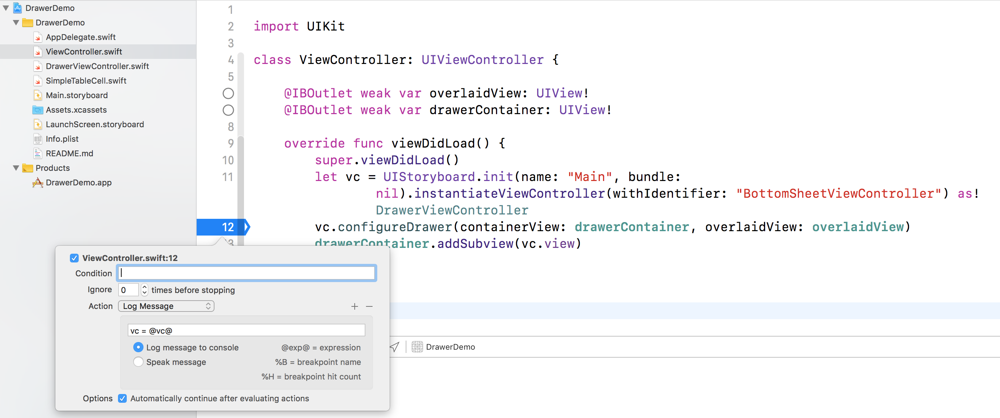

# DrawerDemo
Demo of a bottom drawer that slides in and out.

Unfortunately, doesn't work. But will work if you add this breakpoint.

**Solution**
The reason it is flaky is explained here: https://stackoverflow.com/a/53717173/1256015. The drawer view is added to the parent view, but the code failed to add the child view controller to the parent as explained by Apple at https://developer.apple.com/library/archive/featuredarticles/ViewControllerPGforiPhoneOS/ImplementingaContainerViewController.html. I had not learned about container views until today.
